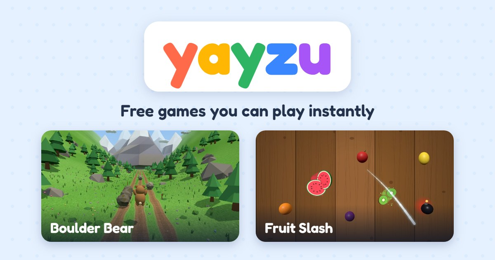
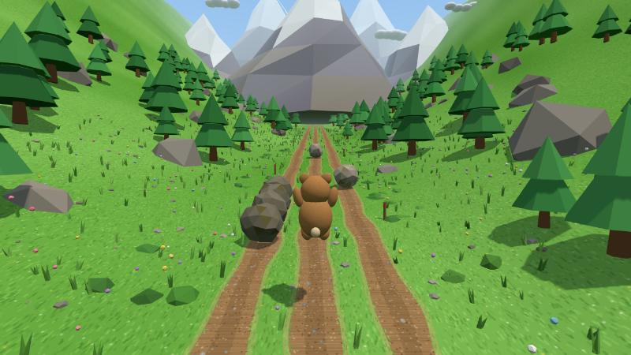
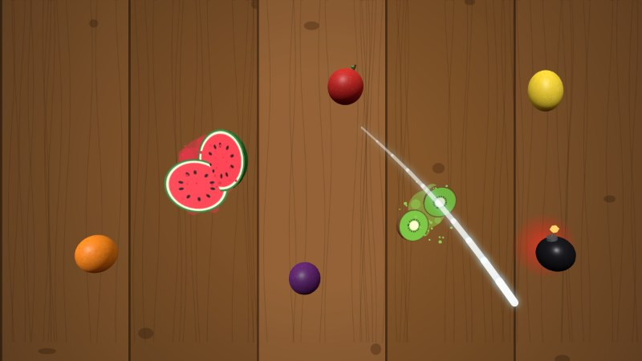

# Yayzu

**Tiny games. Big yay.**

[](https://yayzu.com)

[Yayzu](https://yayzu.com) is a home for small, fun browser games. Tap a game and you're playing:
no downloads, no installs, no sign-up. Every game works on phones, tablets and computers, and every
game is free.

## Play now

| | Game | |
| --- | --- | --- |
| [](https://yayzu.com/boulder-bear/) | **[Boulder Bear](https://yayzu.com/boulder-bear/)** | Help a brave teddy dodge, jump, duck and ride everything rolling down a mountain. |
| [](https://yayzu.com/fruit-slash/) | **[Fruit Slash](https://yayzu.com/fruit-slash/)** | Swipe to slice flying fruit, chain combos, and never hit a bomb. |

More games are on the way.

## What Yayzu is about

- **Instant.** Games open in a second or two, right in the browser. Nothing to install, no
  account, no waiting.
- **Everywhere.** Swipe on a phone held upright, or use the keyboard and mouse on a computer.
- **Light.** Games are small enough to load quickly on mobile data and run smoothly on everyday
  phones.
- **Free.** Every game on Yayzu is free to play.
- **Made by indie developers.** Games come from small studios and solo makers, and anyone can
  submit one.

## Contribute

There are a few ways to help make Yayzu better:

- **Submit your game.** Made a web game? We'd love to host it. See [Submit your game](#submit-your-game).
- **Report a bug.** If a game breaks, won't load or plays badly on your device,
  [open an issue](https://github.com/yaKashif/yayzu/issues/new) and tell us which game, which
  device and what happened.
- **Suggest a game or idea.** Tell us what you'd like to play next, or what would make the site
  better, in an [issue](https://github.com/yaKashif/yayzu/issues/new).
- **Fix a game page.** Spotted a typo or a confusing tip? Each game's page is in its own folder,
  like `fruit-slash/`. Send a pull request with the fix.
- **Improve a game.** The code for Yayzu's own games is open, in [`source/`](source/): Boulder
  Bear and Fruit Slash, built with three.js. Bug fixes and polish are welcome.

## Submit your game

Games are submitted as pull requests to this repository.

1. **Fork** this repository.
2. **Add your game** in a new folder, `games/<slug>/`, where `<slug>` is a short lowercase name
   with hyphens, like `fruit-slash`. The folder needs:
   - your game's files, with `index.html` as the starting page,
   - a `game.json` file describing your game ([format below](#describing-your-game-gamejson)),
   - a thumbnail, `thumbnail.jpg` or `thumbnail.webp`.
3. **Try it** by serving the repository folder with any static server, for example
   `npx serve .`, then opening `/games/<slug>/`. Try it on a phone too.
4. **Open a pull request** titled `Add game: <Title>`. The template walks you through the
   checklist below.

We play every submission on a computer and a phone. If it meets the guidelines, we write its game
page, add it to the home page and publish it. If something needs changing, we'll say what in the
pull request.

Not comfortable with pull requests? [Open an issue](https://github.com/yaKashif/yayzu/issues/new)
with a link to your game and we'll take it from there.

## Guidelines

### Fast and light

Many Yayzu players are on phones and mobile data, so games need to load fast and run smoothly.

- **Small.** What loads before the first screen should be under **3 MB compressed**, and the whole
  game under **15 MB**. Load extras like more levels or music after play starts.
- **Quick to start.** A player should be playing within about **3 seconds** on a mid-range phone.
- **Smooth.** Aim for **60 fps** on a mid-range phone, and never below 30 fps in normal play.
- **Polite.** Pause the game and its sound when the tab is hidden, and leave no errors in the
  browser console.

### Plays in the browser

Games run entirely in the browser, embedded on their Yayzu page.

- **Just files.** HTML, JavaScript, CSS, WebAssembly, images, audio and fonts. No installs,
  plugins, downloads or server code.
- **Self-contained.** Include your libraries and assets in your folder. The game must be playable
  without connecting to anything else; online extras like leaderboards must be optional.
- **Relative paths.** Reference files as `./sprites/hero.png`, not `/sprites/hero.png`.
- **Works in a frame.** Don't redirect the page around the game, and open links with
  `target="_top"`.
- **Computer and phone.** Support keyboard or mouse and touch, in current Chrome, Safari, Firefox
  and Edge.
- **Sound after a tap.** Start sound on the first tap, click or key press, and offer a mute
  button.
- **No ads, tracking or data collection** in your game. Saving progress or high scores in the
  browser is fine.

### Tells players what it is

Every game comes with a `game.json` file and a thumbnail. We use them for the game's page, its
tile on the home page and what search engines show.

- **Thumbnail:** 16:9, at least **800×450** (1200×675 is ideal), under **200 KB**. Keep the main
  subject near the centre, since home page tiles are cropped square. Avoid text in the image.
- **`game.json`:** see the format below.

### Right for everyone

- **Yours to share.** Everything in your game must be yours or licensed for commercial use: no
  characters, music or art from other games, films or brands.
- **Family friendly.** Suitable for all ages, with no graphic violence, sexual content or hateful
  material.
- **Made with AI? Welcome**, as long as the game is polished, original and fun, not raw generated
  output.

## Describing your game: `game.json`

```json
{
  "slug": "fruit-slash",
  "title": "Fruit Slash",
  "shortDescription": "Swipe to slice flying fruit, chain combos, and never hit a bomb.",
  "description": "Watermelons, oranges, apples and more come flying up from below...",
  "genres": ["Arcade", "Casual"],
  "tags": ["fruit", "slicing", "swipe"],
  "howToPlay": ["Swipe across flying fruit to slice it.", "Never cut a bomb."],
  "controls": {
    "keyboard": [{ "action": "Slice", "keys": ["Mouse: hold the button and swipe"] }],
    "touch": [{ "action": "Slice", "gesture": "Swipe across the fruit" }]
  },
  "orientation": "any",
  "platforms": ["desktop", "mobile"],
  "entry": "index.html",
  "thumbnail": "thumbnail.jpg",
  "engine": "three.js",
  "author": { "name": "Your name or studio", "url": "https://example.com" },
  "version": "1.0.0",
  "released": "2026-10-01",
  "sizeKB": { "total": 608, "initialGzip": 146 },
  "contentRating": "everyone"
}
```

| Field | Required | What to put |
| --- | --- | --- |
| `slug` | Yes | The folder name. Lowercase letters, numbers and hyphens. |
| `title` | Yes | The game's name, as players should see it. |
| `shortDescription` | Yes | One sentence, up to 160 characters. Shown in search results and link previews. |
| `description` | Yes | A paragraph about the game for its page. |
| `genres` | Yes | One to three, such as Arcade, Puzzle, Racing, Runner, Shooter, Sports or Strategy. |
| `tags` | No | Other words people might search for. |
| `howToPlay` | Yes | A few short steps explaining how to play. |
| `controls` | Yes | Keyboard and touch controls. Include `touch` if the game works on phones. |
| `orientation` | Yes | `any`, `portrait` or `landscape`: how to hold a phone to play. |
| `platforms` | Yes | `desktop`, `mobile`, or both. |
| `entry` | Yes | The page that starts the game, normally `index.html`. |
| `thumbnail` | Yes | The thumbnail's file name. |
| `engine` | No | What you built it with, such as three.js, Phaser, PixiJS or Godot. |
| `author` | Yes | Your name or studio, and a link if you like. |
| `version` | Yes | Raise it whenever you send an update. |
| `released` | Yes | First release date, as `YYYY-MM-DD`. |
| `sizeKB` | Yes | `total`: the whole folder. `initialGzip`: what loads before the first screen, compressed. |
| `contentRating` | Yes | `everyone`. Games for older audiences aren't accepted yet. |

## Submission checklist

- [ ] The game is in `games/<slug>/` with `index.html` as its starting page.
- [ ] `game.json` is complete and its `slug` matches the folder name.
- [ ] The thumbnail is 16:9, at least 800×450 and under 200 KB.
- [ ] It loads under 3 MB before the first screen, and the whole game is under 15 MB.
- [ ] It starts within about 3 seconds and runs smoothly on a mid-range phone.
- [ ] It works with keyboard or mouse on a computer and with touch on a phone.
- [ ] All paths are relative, and it works inside a frame.
- [ ] It doesn't need to connect to anything outside its own folder.
- [ ] No ads, tracking or data collection.
- [ ] Sound starts after the first tap or key press, and can be muted.
- [ ] It pauses when the tab is hidden, and the console shows no errors.
- [ ] Everything in it is yours or licensed for commercial use, and it suits all ages.
